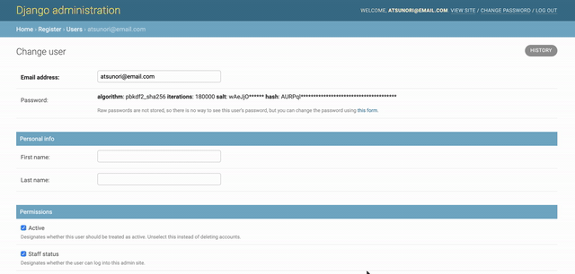
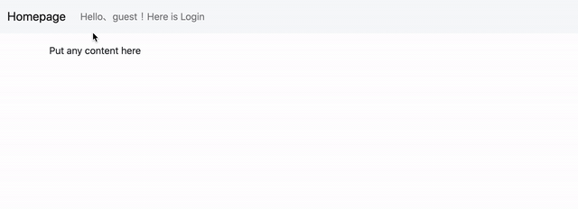
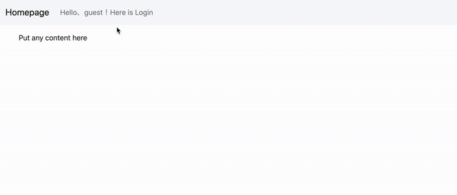
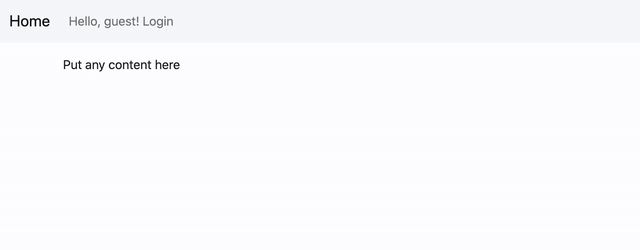
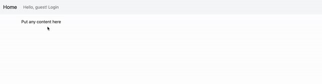
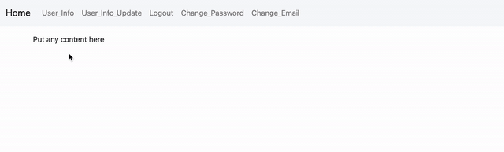

# Django_Registration_Implementation

[referred blog](https://narito.ninja/blog/detail/38/)

## usermodel customizaton

## login/logout implementation

## signup email confirmation

## user info update

## password reset

## email change

